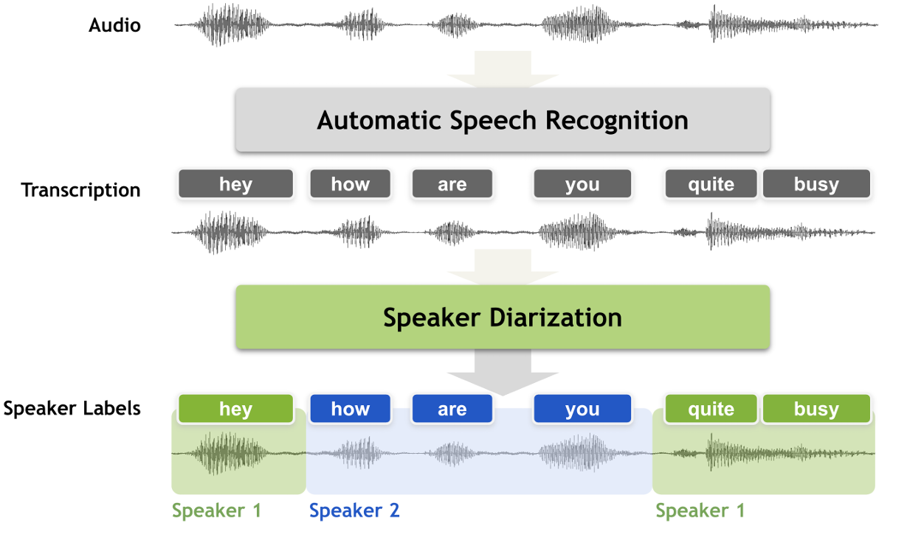

# Diarizer

This project implements an automatic speaker diarization pipeline using NVIDIA NeMo models. The system takes audio files as input and outputs transcriptions labeled with speaker identities and word-level timestamps.

It integrates:
- Automatic Speech Recognition (ASR) -> `stt_multilingual_fastconformer_hybrid`
- Voice Activity Detection (VAD) -> `vad_multilingual_marblenet`
- Speaker Identification -> `titanet-l`

The system is designed to run inside a Docker container and supports multilingual audio.




---

## How It Works

1. **Audio Ingestion**: An audio file is loaded and checked for format (mono, 16kHz). If not compliant, it's resampled.
2. **Transcription**: The ASR model transcribes speech and provides word timestamps.
3. **Voice Activity Detection**: VAD detects speech regions. 
4. **Speaker identification**: embeddings are extracted from voice segments and clustered to assign speaker labels.
5. **Output Formatting**: The diarized transcript is converted into a structured JSON format.

---

## File Descriptions & Interactions

### `main.py`
Main entry point. It:
- Loads a manifest file (e.g., list of audio paths)
- Iterates over entries
- For each audio:
  - Runs `add_audiofile()` and `set_config()` from `ASR_diar.py`
  - Calls `transcript_infer()`, `diarization()` and `convertJSON()`

### `ASR_diar.py`
Initialize the pretrained models with the given configurations. 

Run the pipeline:  
  1. Transcribe  
  2. VAD  
  3. Speaker identification  
  4. Combine the transcriptions and labelled identifications  
  5. Write the results in a JSON file.   

---

## Input Format

Each audio file must be defined as a JSON line in:

```
data/input_manifest.json
```

Example:

```json
{
  "audio_filepath": "AudioSample/resampled/audio.wav",
  "offset": 0,
  "duration": audio_duration("AudioSample/resampled/audio.wav"),
  "label": "infer",
}
```

---


## 🧾 Output Format

Each final JSON contains:
- Speaker-tagged tokens
- Word-level timestamps in milliseconds

```json
{
  "tokens": [
    {
      "data": "Hello",
      "speaker": { "id": "spk0" },
      "start_millis": 0,
      "end_millis": 500
    }
  ],
  "transcription_content": "...",
  ...
}
```

## Other
For more information you can check the performances details [here](Diarizer_documentation.pdf).

